# Networking Nights
A monthly meetup to hear women speak about technology, make new connections, and help us build a community of technical women in Portland.

## Format

- Lightning Talks (shorter tech talks, 8-10 minutes each)
- Panel (45 minute panel)
- Workshop (45-90 minute workshop)
- Around the World (split attendees in three to four different rooms for presentations, 10-15 minutes in each room, then the groups switch rooms)

## Our Hosts or Partners

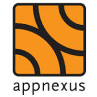
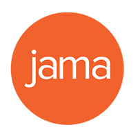

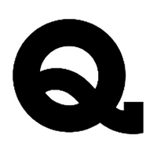

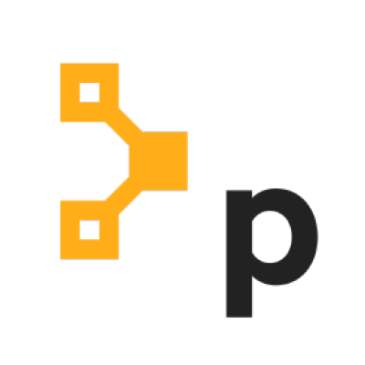

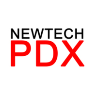

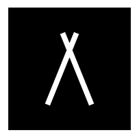

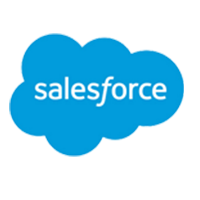

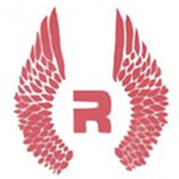

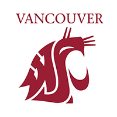
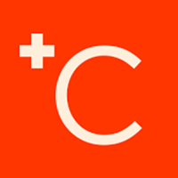
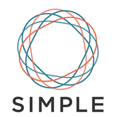
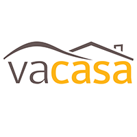
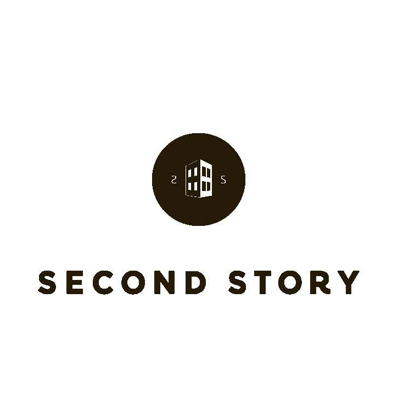
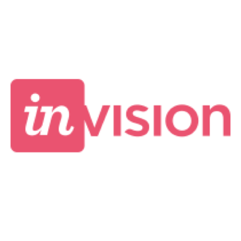

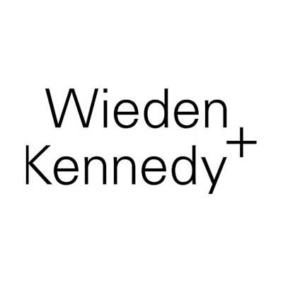
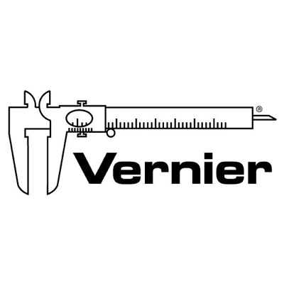
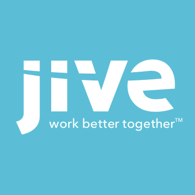
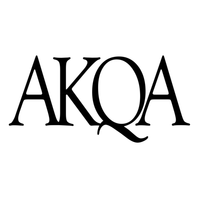
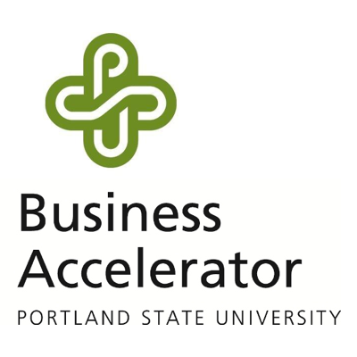

## Goals
  
- provide an opportunity for engineers and technical women to speak about technology
- learn about new technologies
- make new connections
- create a community of women who code and women learning to code in Portland

## Our Schedule

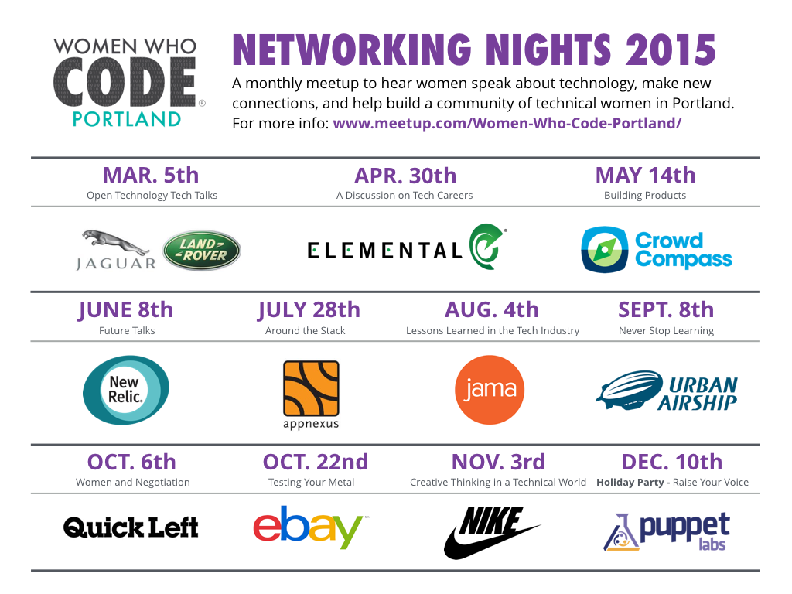
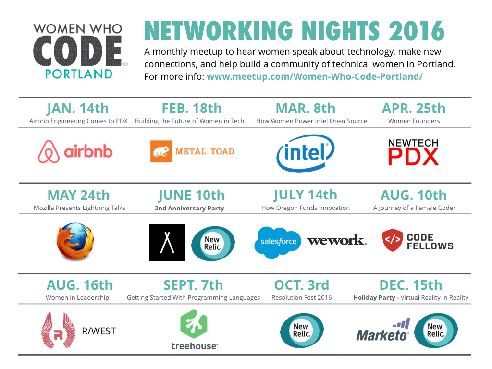
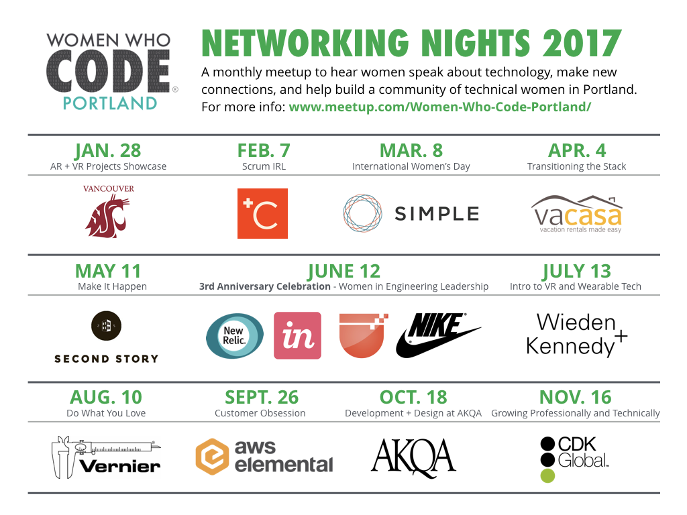

## Event Themes

2015

- March 5 - [Jaguar Land Rover](http://www.meetup.com/Women-Who-Code-Portland/events/220626662/) - "Open Software Technology Center Tech Talks"
- April 30 - [Elemental Technologies](http://www.meetup.com/Women-Who-Code-Portland/events/221404142/) - "A Discussion on Tech Careers"
- May 14 - [CrowdCompass](http://www.meetup.com/Women-Who-Code-Portland/events/222216437/) - "Building Products"
- June 8 - [New Relic](http://www.meetup.com/Women-Who-Code-Portland/events/222804928/) - "Future Talks"
- July 28 - [AppNexus](http://www.meetup.com/Women-Who-Code-Portland/events/223973917/) - "Around the Stack"
- Aug. 4 - [Jama Software](http://www.meetup.com/Women-Who-Code-Portland/events/224075227/) - "Lessons Learned in the Tech Industry"
- Sept. 8 - [Urban Airship](http://www.meetup.com/Women-Who-Code-Portland/events/224842443/) - "Never Stop Learning"
- Oct. 6 - [Quick Left](http://www.meetup.com/Women-Who-Code-Portland/events/225695607/) - "Women and Negotiation: Professional Happiness, One Conversation at a Time"
- Oct. 22 - [eBay](http://www.meetup.com/Women-Who-Code-Portland/events/225978076/) - "Testing Your Metal in the Portland Tech Scene"
- Nov. 3 - [Nike](http://www.meetup.com/Women-Who-Code-Portland/events/226195388/) - "Creative Thinking in a Technical World"
- Dec. 10 - [Puppet Labs / Women+Tech Holiday Party](http://www.meetup.com/Women-Who-Code-Portland/events/226200377/) - "Raise Your Voice"

2016

- Jan. 14 - [Airbnb](http://www.meetup.com/Women-Who-Code-Portland/events/227343182/) - "Airbnb Engineering Comes to Portland"
- Feb. 18 - [Metal Toad](http://www.meetup.com/Women-Who-Code-Portland/events/227725819/) - "Building the Future of Women in Tech"
- March 8 - [Intel](http://www.meetup.com/Women-Who-Code-Portland/events/227870415/) - "How Women Power Intel Open Source"
- April 18 - [New Tech PDX](http://www.meetup.com/Women-Who-Code-Portland/events/230443414/) - "Women Who Code"
- May 24 - [Mozilla](http://www.meetup.com/Women-Who-Code-Portland/events/230446085/) - "Lightning Talks"
- June 10 - [Instrument + New Relic / 2nd Anniversary Party](http://www.meetup.com/Women-Who-Code-Portland/events/231386050/)
- July 14 - [WeWork + Salesforce / Women+Tech Summer Soiree](http://www.meetup.com/Women-Who-Code-Portland/events/231401151/) - "How Oregon Funds Innovation"
- Aug. 10 - [Code Fellows PDX](http://www.meetup.com/Women-Who-Code-Portland/events/232784915/) - "A Journey of a Female Coder"
- Aug. 16 - [R/West](http://www.meetup.com/Women-Who-Code-Portland/events/231403787/) - "Women in Leadership"
- Sept. 7 - [Treehouse](http://www.meetup.com/Women-Who-Code-Portland/events/233479741/) - "Getting Started With Programming Languages"
- Oct. 3 - [New Relic](https://www.meetup.com/Women-Who-Code-Portland/events/234156803/) - "Resolution Fest"
- Dec. 15 - [Women+Tech Holiday Party](http://www.meetup.com/Women-Who-Code-Portland/events/235140255/) - "Virtual Reality in Reality!"

2017

- Jan. 28 - [WSU Vancouver](https://www.meetup.com/Women-Who-Code-Portland/events/236509845/) - "AR + VR Project Showcases"
- Feb. 7 - [+Citizen](https://www.meetup.com/Women-Who-Code-Portland/events/236509936/) - "Scrum IRL"
- March 8 - [Simple](https://www.meetup.com/Women-Who-Code-Portland/events/236510010/) - "International Women's Day"
- April 4 - [Vacasa](https://www.meetup.com/Women-Who-Code-Portland/events/236510111/)
- May 11 - [Second Story](https://www.meetup.com/Women-Who-Code-Portland/events/236510126/)
- June 12 - [New Relic + InVision](https://www.meetup.com/Women-Who-Code-Portland/events/236510149/) - "3rd Anniversary Celebration"
- July 13 - [Wieden + Kennedy](https://www.meetup.com/Women-Who-Code-Portland/events/236510268/)
- Aug. 9 - Vernier
- Aug. 24 - Jive
- Sept. - AKQA
- Oct. 12 - PSU Business Accelerator
- Dec. - Women+Tech Holiday Party

## Speakers

See a full list of [past speakers](past-speakers.md).

## Promos

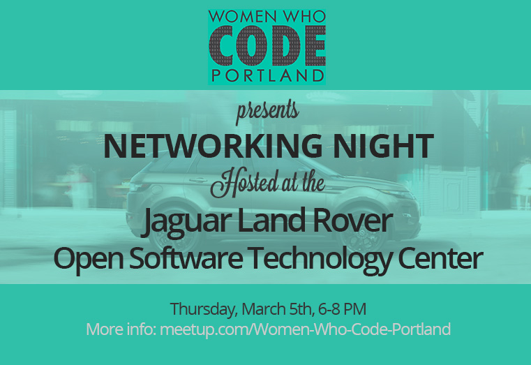
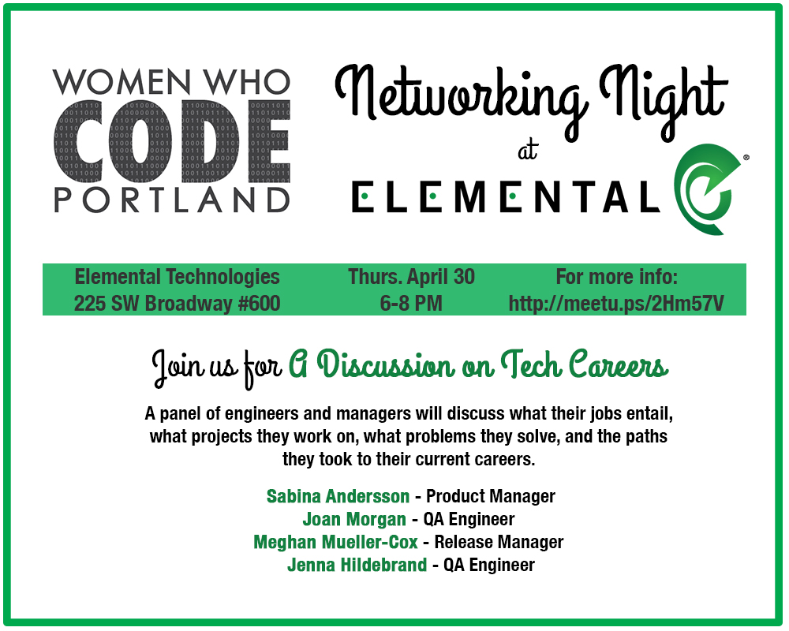
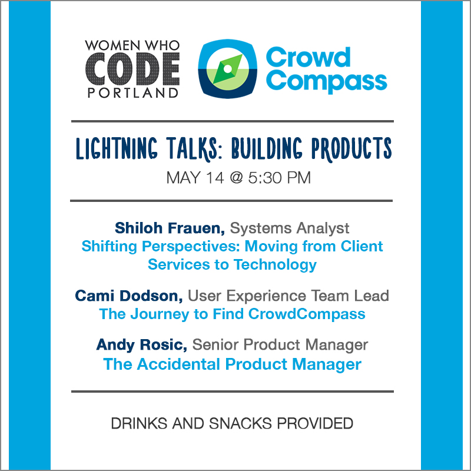
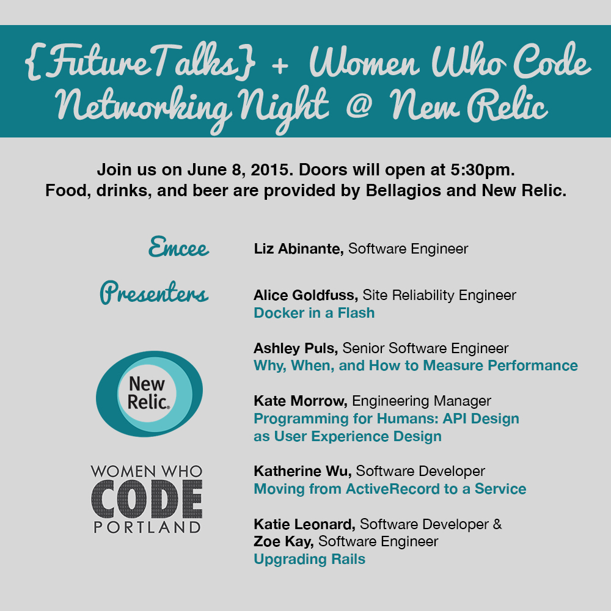

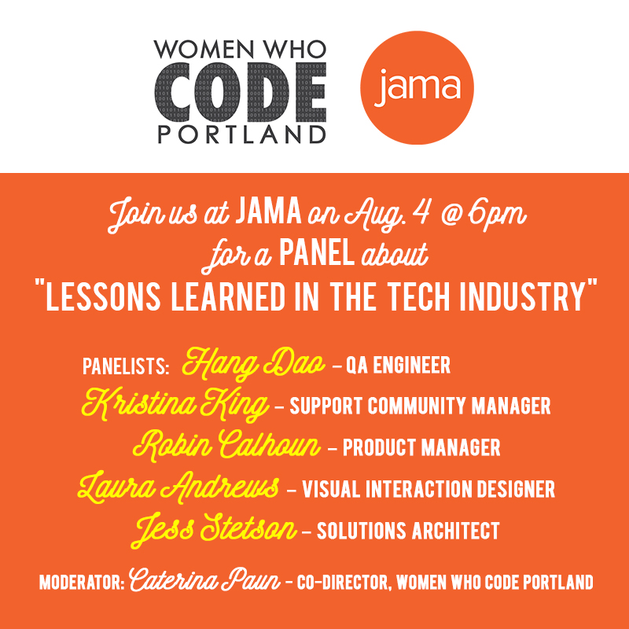
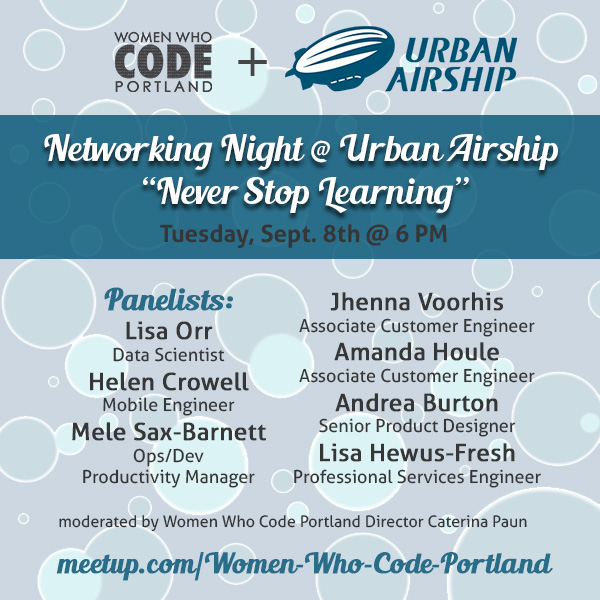
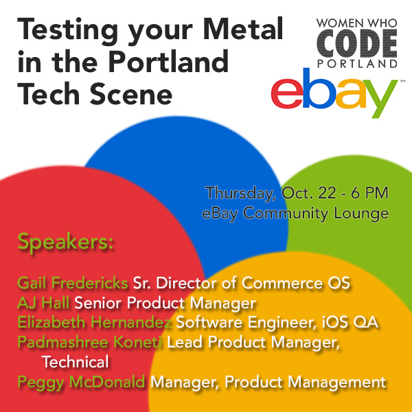

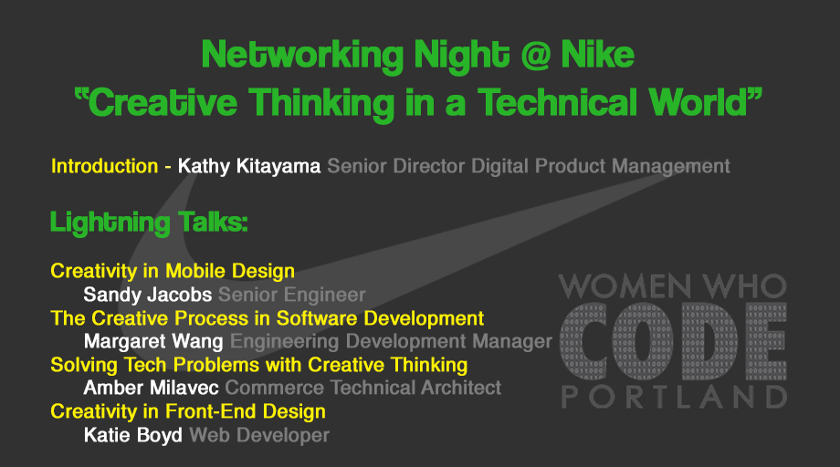
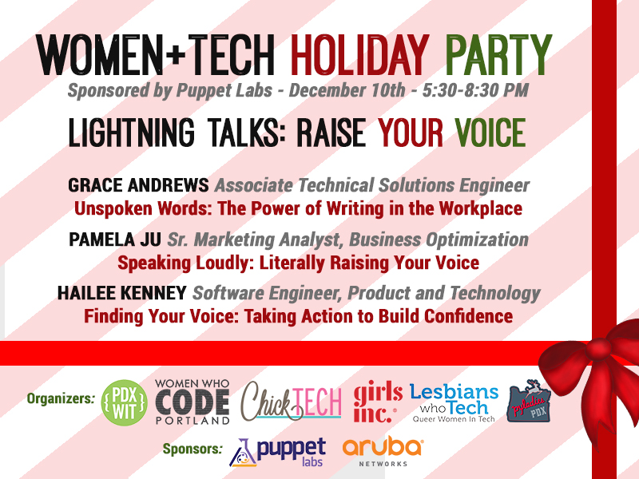
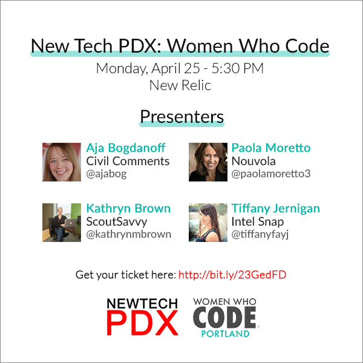
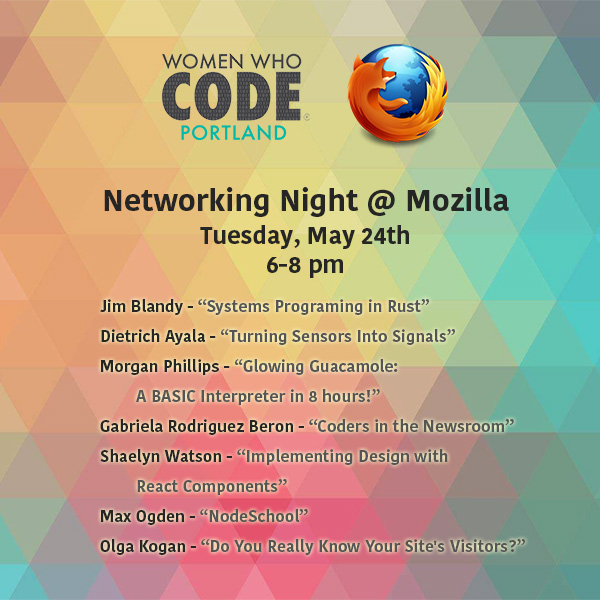

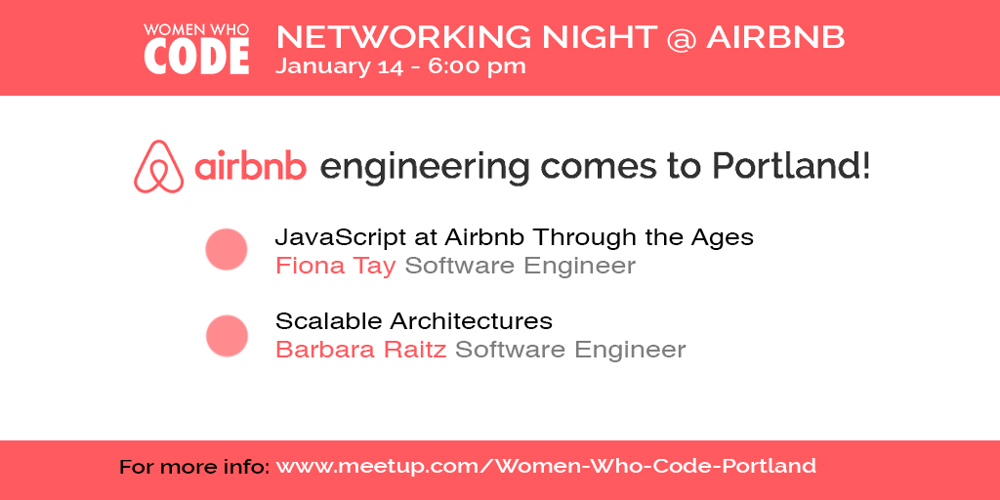
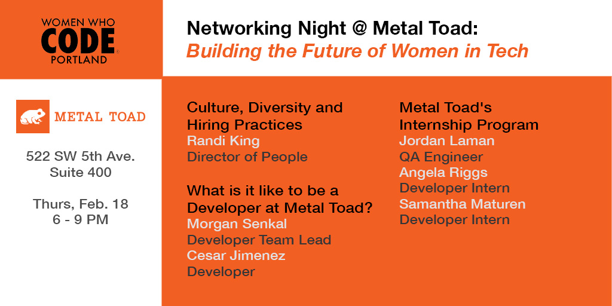

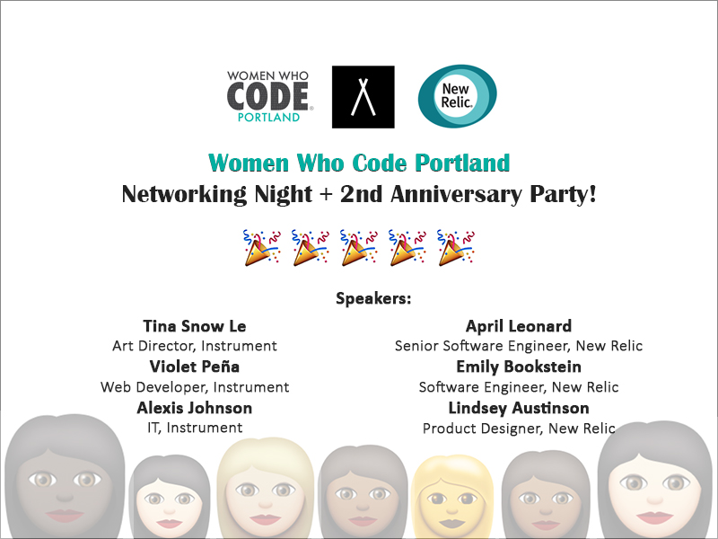
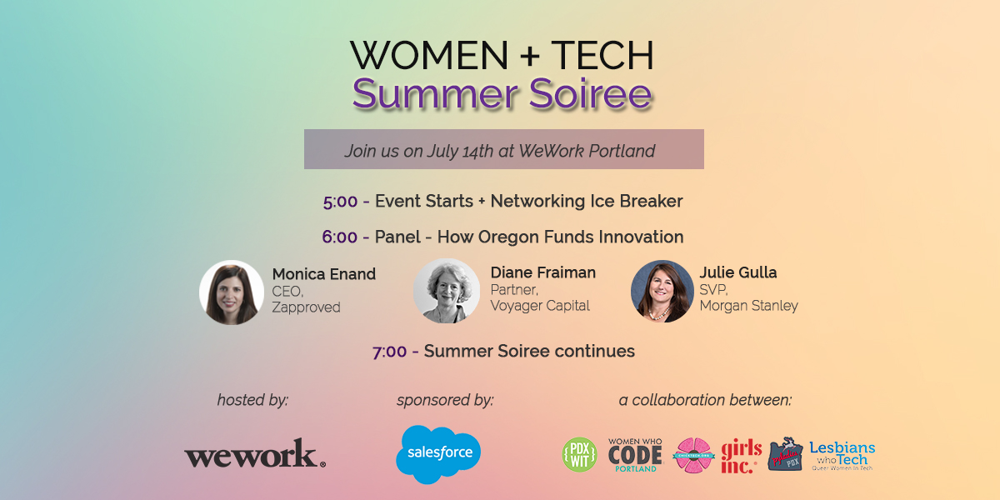
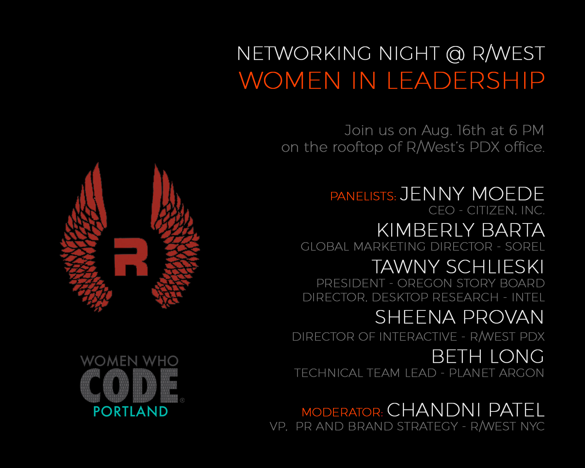

## FAQs

- Have questions? Want to host us? Visit our [FAQ](faqs.md) page.
- This [to-do list](event-planning/event-to-do.md) is our checklist for event planning.

