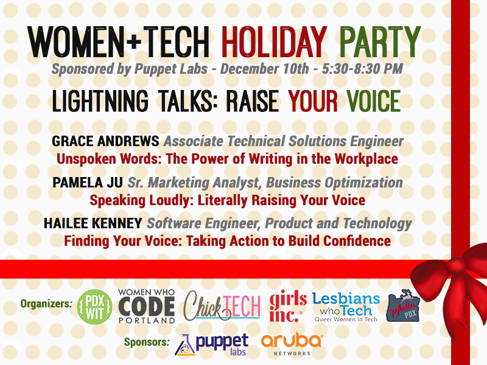

# Networking Nights
A monthly meetup to hear women speak about technology, make new connections, and help build a community of technical women in Portland.

##Goals

- provide an opportunity for engineers and technical women to speak about technology
- learn about new technologies
- make new connections
- create a community of women who code and women learning to code in Portland

##Our Events

- [Past and Future Events](https://github.com/wwcodeportland/networking-nights/blob/master/networking-nights.md)
- [2015 Networking Night Schedule](https://github.com/wwcodeportland/networking-nights/blob/master/networking-nights-2015-schedule.pdf)
- [2016 Networking Night Schedule] (https://github.com/wwcodeportland/networking-nights/blob/master/networking-nights-2016-schedule.pdf)

##Companies Who Have Hosted Us

##Format

- Lightning Talks (shorter tech talks, 5-10 minutes each)
- Panel
- Workshop 
- Around the World (split attendees in three to four different rooms for presentations)

##Past Themes

2015

- March 5 - [Jaguar Land Rover -] (http://www.meetup.com/Women-Who-Code-Portland/events/220626662/) "Open Software Technology Center Tech Talks"
- April 30 - [Elemental Technologies -] (http://www.meetup.com/Women-Who-Code-Portland/events/221404142/) "A Discussion on Tech Careers"
- May 14 - [CrowdCompass -] (http://www.meetup.com/Women-Who-Code-Portland/events/222216437/) "Building Products"
- June 8 - [New Relic -] (http://www.meetup.com/Women-Who-Code-Portland/events/222804928/) "Future Talks"
- July 28 - [AppNexus -] (http://www.meetup.com/Women-Who-Code-Portland/events/223973917/) "Around the Stack"
- Aug. 4 - [Jama Software] (http://www.meetup.com/Women-Who-Code-Portland/events/224075227/) "Lessons Learned in the Tech Industry" 
- Sept. 8 - [Urban Airship -] (http://www.meetup.com/Women-Who-Code-Portland/events/224842443/) "Never Stop Learning"
- Oct. 6 - [Quick Left -] (http://www.meetup.com/Women-Who-Code-Portland/events/225695607/) "Women and Negotiation: Professional Happiness, One Conversation at a Time" 
- Oct. 22 - [eBay -] (http://www.meetup.com/Women-Who-Code-Portland/events/225978076/) "Testing Your Metal in the Portland Tech Scene"
- Nov. 3 - [Nike -] (http://www.meetup.com/Women-Who-Code-Portland/events/226195388/) "Creative Thinking in a Technical World"
- Dec. 10 - [Puppet Labs / Women + Tech Holiday Party -] (http://www.meetup.com/Women-Who-Code-Portland/events/226200377/) "Raise Your Voice" 

2016

- Jan. 14 - [Airbnb -] (http://www.meetup.com/Women-Who-Code-Portland/events/227343182/) "Airbnb Engineering Comes to Portland"
- Feb. 18 - [Metal Toad -] (http://www.meetup.com/Women-Who-Code-Portland/events/227725819/) "Building the Future of Women in Tech"
- March 8 - [Intel -] (http://www.meetup.com/Women-Who-Code-Portland/events/227870415/) "How Women Power Intel Open Source"
- April 18 - New Tech PDX
- June 10 - Instrument + 2nd Anniversary Party
- July 14 - WeWork / Women + Tech Summer Soiree
- Aug. 16 - R/West
- Sept. - Treehouse

##Graphics

##FAQs

Link to page with FAQs - Coming soon...

##Panel

- [Example - Panel Questions](panel-questions.md)
